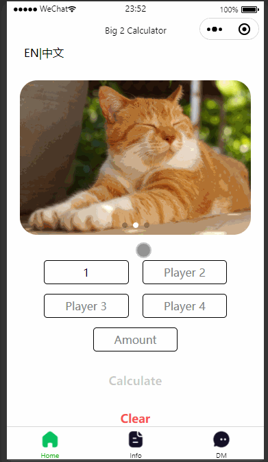
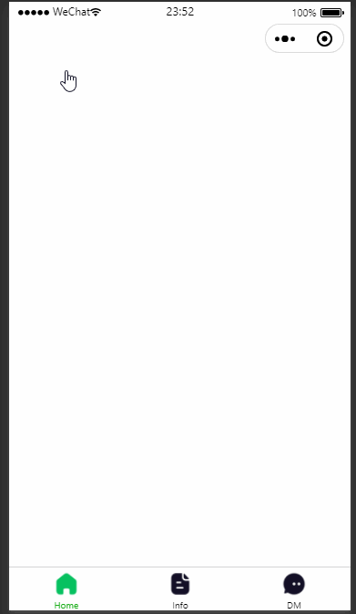
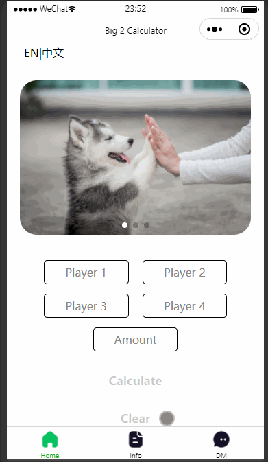

# Big2-Calculator-wechat-miniapp
* This is a Wechat miniapp that can calculate the score for a card game call Big2.
* Calculate button only active once all the inputs have value
> 
* Included a language switch to switch between Chinese and English
> 
* Included a clear function to clear all the inputs
* Clear button only active once at least have one input
> 

## Getting Started
* You can *[clone](https://github.com/arrickx/Big2-Calculator-Wechat-miniapp.git)* or *[download](https://github.com/arrickx/Big2-Calculator-Wechat-miniapp.git)* this project via [GitHub](https://github.com) to your local machine.
* Download and Install *[Weixin DevTools](https://developers.weixin.qq.com/miniprogram/en/dev/devtools/download.html)*

## How to use
* Open existing Wechat miniapp
* Use Weixin DevTools to run this app

## License
* This project is licensed under the MIT License - see the [LICENSE](LICENSE) file for details.